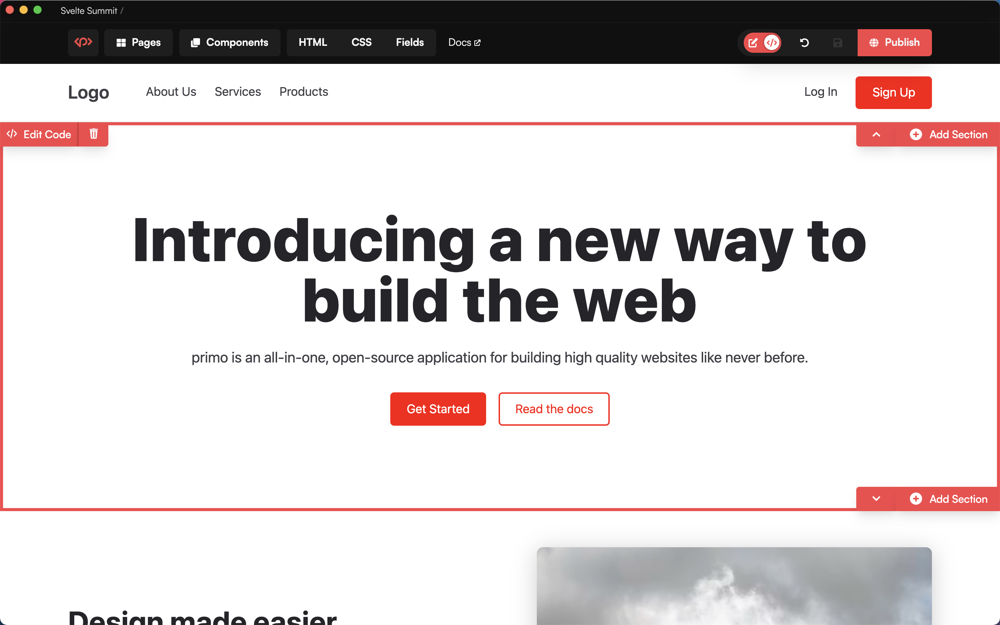
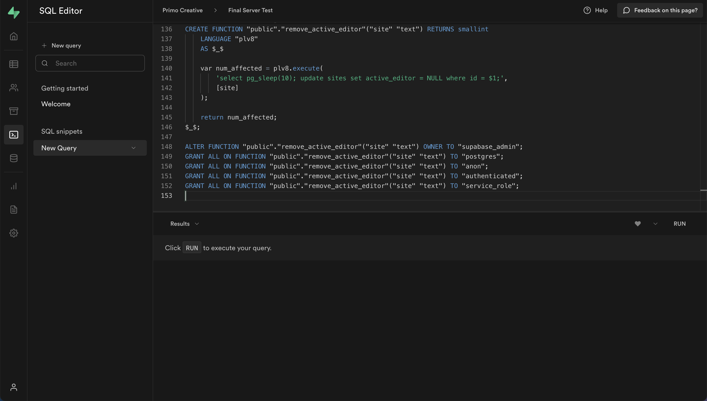

# Primo Server
[Primo](https://primo.so) is a component-based CMS that makes it easier to develop, manage, and publish static sites. This project hosts Primo as a SvelteKit application and integrates it with [Supabase](https://supabase.com) to enable authentication, media uploads, and data storage. A single Primo server can handle hundreds of sites, publishes static sites to their own repos/endpoints, and enables rapid component-driven development. 

This is a base repository for Primo Server that you can fork to host your own Server. All you need is a Supabase and Vercel or Cloudflare account (all free), and a few minutes to put up your Server from which you can create and manage one to hundreds of sites. Compared to Primo Desktop, Primo Server enables you to access your sites online, collaborate with developers and marketers, and upload images. You can also access your Server sites from Primo Desktop. 

### Features
* Multiple users
* Image uploads
* Use from anywhere

## Project Status
Primo Server is in Beta. It is stable enough for personal projects.

## How it works
This repo deploys Primo to [Vercel](https://vercel.com) or [Cloudflare](https://cloudflare.com) and uses [Supabase](https://supabase.co) for authentication, database (PostgreSQL), and storage. 

## Setup 
Primo can be run on the free tier of either service (Vercel/Cloudflare & Supabase), and you can sign in with Github.

Before deploying your Primo Server, you'll need to sign up for [Supabase](https://supabase.co) and create a new project. 

### 1. Fork this repository

### 2. Deploy Backend (Supabase)
1. Create a [Supabase](https://supabase.co) account or sign in with Github
1. Create a new project
1. Disable email confirmations (Authentication > Providers > expand Email and uncheck 'Confirm email')
1. Select 'SQL' from the sidebar navigation
1. Click **+ New query** 
1. Paste in the contents of [`./primo_schema.sql`](https://raw.githubusercontent.com/primo-af/primo-server/master/primo_schema.sql) and click 'RUN' 

### 3. Deploying Frontend 

#### Deploying to Vercel:
1. Create a [new Vercel project](https://vercel.com/new)
1. Select your forked repository
1. Enter the following environment variables: your Supabase project **URL**, **Public Key (anon public)**, and **Admin Key (service_role secret)** (which you can find in the Supabase project dashboard > Settings > API https://app.supabase.io/project/---yourprojectid---/settings/api) and deploy. 
* VITE_SUPABASE_URL
* VITE_SUPABASE_PUBLIC_KEY
* VITE_SUPABASE_ADMIN_KEY

#### Deploying to Cloudflare Pages: 
1. Create a new [Cloudflare Pages](https://pages.cloudflare.com) project
1. Select your forked repository
1. Configure the project according to the screenshot below - don't select a framework preset, enter the build command, output directory, and the following environment variables - and deploy.
* VITE_SUPABASE_URL
* VITE_SUPABASE_PUBLIC_KEY
* VITE_SUPABASE_ADMIN_KEY
* NODE_VERSION = 16

4. Navigate to your new Primo Server. Sign up with an email address and password (this will be the admin account). 

### Updating

You can merge upstream updates by clicking 'Sync fork' on your forked repository. Your updates will automatically deploy to your Vercel/Cloudflare account. 
