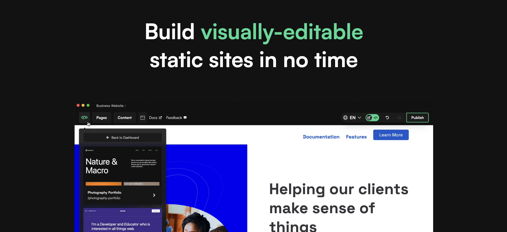

# Primo
Primo is a component-based CMS that makes it easy to build visually-editable static sites. Instead of developing your website by editing files, Primo lets you build web pages out of individual components (or sections) containing both code *and* content. By embedding a development environment alongside the CMS, Primo enables you to make site modifications on the fly and build/integrate components that can be used by content editors (who don't have access to the code) to arrange pages and sites section by section. Primo also gives content editors an ideal page building and content management experience that enables anyone to easily update component content, write copy directly on the page, and publish site changes. When you publish and update your site, Primo compiles and deploys it as a static site (with no JS by default) to Vercel, Netlify, Github, etc. 

## Features
- radically **simpler content editing** - focused fields for components, content & on-page editing for editorial content
- a powerful **component-editor** which you can use to modify any component on your site, applying updates to all instances of that component across your site
- a **component library** for managing the  components used on a site (including importing components from other primo sites or building new ones from scratch)
- **component packs** and templates built with clean, editable code. 
- **static site generation** which builds and uploads minimal HTML, CSS, and framework-less JavaScript files to your connected host. 
- **static host and Github integration** which creates a new Vercel/Netlify sites and Github repos for new primo sites, and updates them when you publish updates to your site. 

## Tech
Most of Primo's functionality and productivity advantages are due to Svelte - a compiler and UI language that extends HTML/CSS/JS's functionality to enable templating, style encapsulation, component-driven development, complex interactions and app-like functionality. primo pages are made of Svelte components and doc-like content sections (written with [TipTap](https://tiptap.dev/)), and the Svelte compiler turns those pages into clean HTML, CSS, and vanilla JavaScript that it uploads to a web host or Github repo. 

## How to get started
It's incredibly easy to build a site with Primo. Technically, you don't even have to write any code (though it's highly encouraged). To get started, you can host Primo for yourself using [Primo Server](https://github.com/primodotso/primo-server).
